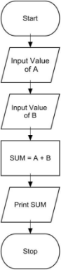
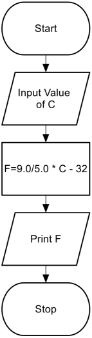
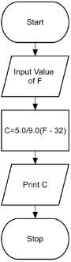
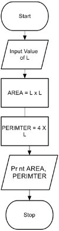
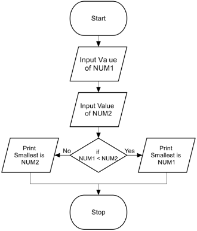
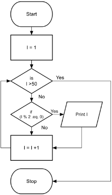

**FLOWCHART:** 

The first design of flowchart goes back to 1945 which was designed by John Von Neumann. Unlike an algorithm, Flowchart uses different symbols to design a solution to a problem. It is another commonly used programming tool. By looking at a Flowchartone can understand the operations and sequence of operations performed in a system. Flowchart is often considered as a blueprint of a design used for solving a specific problem. 

**Advantages of flowchart:** 

- Flowchart is an excellent way of communicating the logic of a program.
- Easy and efficient to analyze problem using flowchart.
- During program development cycle, the flowchart plays the role of a blueprint, which makes program development process easier.
- After successful development of a program, it needs continuous timely maintenance during the course of its operation. The flowchart makes program or system maintenance easier.
- It is easy to convert the flowchart into any programming language code.

**Flowchart**  is  diagrammatic  /Graphical  representation  of  sequence  of  steps  to  solve  a problem. To draw a flowchart following standard symbols are use 

|Symbol Name |Symbol |function |||||
| - | - | - | :- | :- | :- | :- |
|Oval ||Used to represent start and end of flowchart |||||
|Parallelogram ||Used for input and output operation |||||
|Rectangle ||Processing: Used for arithmetic operations and data-manipulations |||||
|Diamond ||Decision making. Used to represent the operation in which there are two/three  alternatives, true and false etc |||||
|Arrows |

` ` 
|Flow line Used to indicate the flow of logic by connecting symbols |||||
|Circle ||Page Connector |||||
|||||Off Page Connector |||
|||Predefined Process /Function Used to represent a group of statements performing one processing task. |||||
|||Preprocessor |||||
||
|-------------- 

`  `--------- | 

|-------------- 
|Comments |||||

**Flowchart to** **find the sum of two numbers** 

**Flowchart to** **convert temperature from Celsius to Fahrenheit** 

**Flowchart to** **convert temperature from  Fahrenheit  to Celsius** 

**Flowchart to** **find Area and Perimeter of Square** 

**Flowchart to** **find the smallest of two numbers** 

**Flowchart to** **find Even number between 1 to 50** 

**Flowchart to** **find  Odd numbers between 1 to n where n is a positive Integer** 

